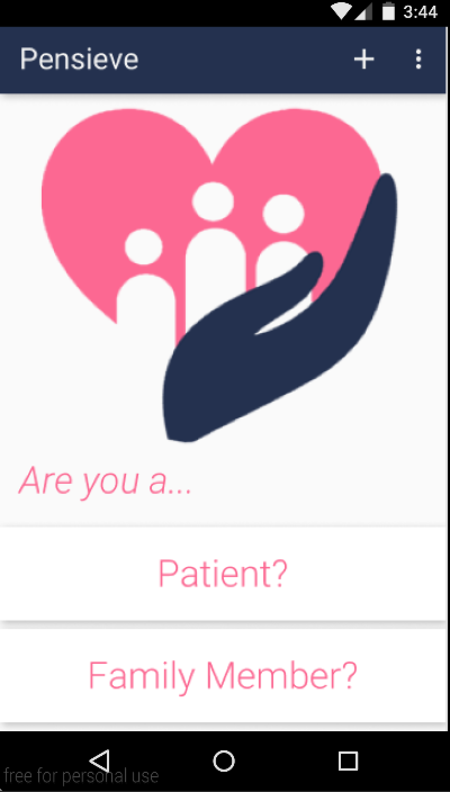
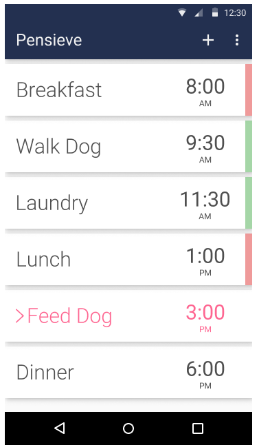
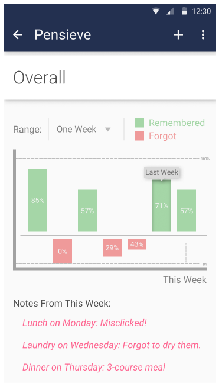
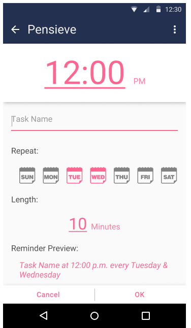
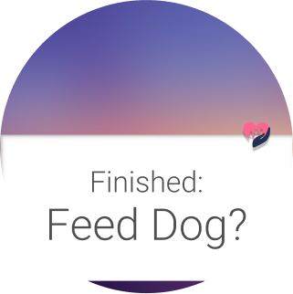

# Group-5-Project

Pensieve_test is the code for our app Pensieve. This was used for the demo and the showcase.

PensieveSkeleton was the code for Prog 3. This is not code for our final project.


## Server
The Pensieve server is hosted on Heroku and runs on Ruby on Rails. The server is used for phone-to-phone communication between family members and patients, and is used for account sign up, authorization, and message transfers.

**GitHub repository:** https://github.com/daltonboll/PensieveServer

**Heroku:** http://pensieve-server.herokuapp.com/

#### Server API documentation

Note: All API calls are expected to be sent and received in JSON.

**1. User Account Creation**

*Description:* Use this API call in order to create a new User account. A "family" account cannot be created without an existing "patient" account. 

*Method:* POST

*Route:* http://pensieve-server.herokuapp.com/api/users

*Fields:*

Key | Type | Required | Restrictions
---- | ---- | ---- | ----
name | string | Yes
email | string | Yes | Must be of the form x@y.domain; Must be unique
password | string | Yes
phone_number | string | Yes | Must be unique; Must be of the form 1112223333 or 111-222-3333 or (111) 222-3333 or (111)222-3333
role | string | Yes | "patient" or "family"
patient_phone_number | string | Only for "family" role | Must be of the form 1112223333 or 111-222-3333 or (111) 222-3333 or (111)222-3333; Must already belong to an existing "patient" role

*Example CURL Request for "patient" account creation:* 

```
curl -H "Content-Type: application/json" -X POST -d '{"name":"Bob", "role":"patient", "email":"bob@mail.com", "password":"password", "phone_number":"1112223333"}' http://pensieve-server.herokuapp.com/api/users
```

*Example Server Response:*
```
{
    "status": 1,
    "user": {
        "id": 1,
        "name": "Bob",
        "email": "bob@mail.com",
        "role": "patient",
        "phone_number": "1112223333"
    }
}
```

*Example CURL Request for "family" account creation:* 

```
curl -H "Content-Type: application/json" -X POST -d '{"name":"Jill", "role":"family", "email":"jill@mail.com", "password":"password", "phone_number":"5556667777", "patient_phone_number":"1112223333"}' http://pensieve-server.herokuapp.com/api/users
```

*Example Server Response:*
```
{
    "status": 1,
    "user": {
        "id": 2,
        "name": "Jill",
        "email": "jill@mail.com",
        "role": "family",
        "phone_number": "5556667777",
        "patient_phone_number": "1112223333"
    },
    "relationships": {
        "patient": {
            "id": 1, 
            "name": "Bob",
            "email": "bob@mail.com",
            "role": "patient",
            "phone_number": "1112223333"
        },
        "family_members": [
            {
                "id": 2,
                "name": "Jill",
                "email": "jill@mail.com",
                "role": "family",
                "phone_number": "5556667777",
                "patient_phone_number":"1112223333"
            },
            ...
        ]
    }
}
```

**2. User Login**

*Description:* Use this API call in order to login to a User account and receive basic information about the account you are logging into.

*Method:* POST

*Route:* http://pensieve-server.herokuapp.com/api/login

*Fields:*

Key | Type | Required | Restrictions
---- | ---- | ---- | ----
email | string | Yes | Must exist in the database
password | string | Yes | Must match the password for the specified email

*Example CURL Request for "patient" login:* 

```
curl -H "Content-Type: application/json" -X POST -d '{"email":"bob@mail.com",  "password":"password"}' http://pensieve-server.herokuapp.com/api/login
```

*Example Server Response:*
```
{
    "status": 1,
    "user": {
        "id": 1,
        "name": "Bob",
        "email": "bob@mail.com",
        "role": "patient",
        "phone_number": "1112223333"
    }
}
```

*Note:* The login request for "family" members is exactly the same as it is for a "patient". However, the server response will also contain "relationships" data. See the example response for "family" user account creation.

**3. Getting User Information**

*Description:* Use this API call in order to get basic information about a specific user. This will not include any information about the user's family members.

*Method:* GET

*Route:* http://pensieve-server.herokuapp.com/api/users/:id

*Fields:*

Key | Type | Required | Restrictions
---- | ---- | ---- | ----
id | string | Yes | Must exist in the database

*Example CURL Request getting basic user information:* 

```
curl -H "Content-Type: application/json" -X GET http://pensieve-server.herokuapp.com/api/users/2
```

*Example Server Response:*
```
{
    "status": 1,
    "user": {
        "id": 2,
        "name": "Jill",
        "email": "jill@mail.com",
        "role": "family",
        "phone_number": "5556667777",
        "patient_phone_number": "1112223333"
    }
}
```

**4. Getting Information For All Members of a Family**

*Description:* Use this API call in order to get basic information about every member of a specific user's family. This includes information about the "patient" and all regular "family" members. 

*Method:* GET

*Route:* http://pensieve-server.herokuapp.com/api/users/:id/relationships

*Fields:*

Key | Type | Required | Restrictions
---- | ---- | ---- | ----
id | string | Yes | Must exist in the database

*Example CURL Request getting basic user information:* 

```
curl -H "Content-Type: application/json" -X GET http://pensieve-server.herokuapp.com/api/users/2/relationships
```

*Example Server Response:*
```
{
    "status": 1,
    "relationships": {
        "patient": {
            "id": 1,
            "name": "Bob",
            "email": "bob@mail.com",
            "role": "patient",
            "phone_number": "1112223333"
        },
        "family_members": [
            {
                "id": 2,
                "name": "Jill",
                "email": "jill@mail.com",
                "role": "family",
                "phone_number": "5556667777",
                "patient_phone_number": "1112223333"
            },
            ...
        ]
    }
}
```

## Activity Overview
The database folder contains database related stuff so that even when you exit out of the app, the data will still exist

main screen = initial login screen

phoneListenerService & phoneToWatchService = deals with phone to watch connection

TaskListActivity = calls on FamilyMemberFragment

FamilyMemberFragment = main fragment for the list of activities

TaskPagerActivity = calls on TaskFragment. This allows us to swipe between multiple new tasks.

TaskFragment = deals with adding a new task

Tasks = class of tasks

TimePickerFragment = deals with time picker

TaskManager = deals with getting the data stored in the database.


## Authors

Dalton Boll

Graham Seyffert

David Koh

Chase Smith 

Casey Nguyen


## Demo Videos

Graph Challenge Video: https://www.youtube.com/watch?v=hHlb3SeXTgc

API Challenge Video: https://youtube.com/watch?v=JpijswasUgI

Pensieve App Demo Video: https://www.youtube.com/watch?v=mm-2BI4NCII&feature=youtu.be

## Screenshots






   



## Acknowledgments
