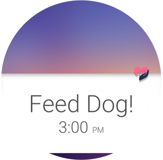

# Group-5-Project
Group 5 Project

PensieveSkeleton is code for Prog3. The video is based on this code

Pensieve_test is our work in progress code for the actual app. This is for the showcase but not for Prog3

## Server
The Pensieve server is hosted on Heroku and runs on Ruby on Rails. The server is used for phone-to-phone communication between family members and patients, and is used for account sign up, authorization, and message transfers.

#### GitHub repository: https://github.com/daltonboll/PensieveServer

#### Heroku: http://pensieve-server.herokuapp.com/

#### Server API documentation

## Activity Overview
The database folder contains database related stuff so that even when you exit out of the app, the data will still exist

main screen = initial login screen

phoneListenerService & phoneToWatchService = deals with phone to watch connection

TaskListActivity = calls on FamilyMemberFragment

FamilyMemberFragment = main fragment for the list of activities

TaskPagerActivity = calls on TaskFragment. This allows us to swipe between multiple new tasks.

TaskFragment = deals with adding a new task

Tasks = class of tasks

TimePickerFragment = deals with time picker

TaskManager = deals with getting the data stored in the database.

## Authors

Dalton Boll

Graham Seyffert

David Koh

Chase Smith 

Casey Nguyen

## Demo Video

## Screenshots

## Acknowledgments
